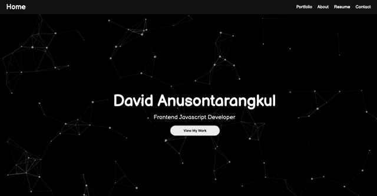

# Hi, I'm David

👋 Currently attending a coding bootcamp at UC Berkeley.

👨🏻‍💻 Constantly learning about new technologies and working on interesting projects.

🎓 Graduated from the University of Florida with a Bachelor's degree in Finance and Master's degree in International Business.

🔥 Professional work experience in accounting, ecommerce, and promoting.

🌱 **Looking for a full time software developement position!**

📫 How to contact me:

- anusontarangkul.d@gmail.com
- [LinkedIn](https://www.linkedin.com/in/anusontarangkul/)

⚡️ Fun Fact: I studied abroad in Thailand and Hong Kong!
